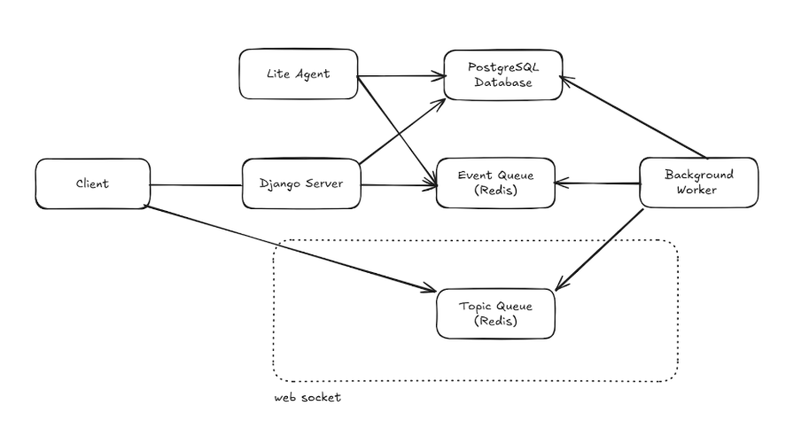
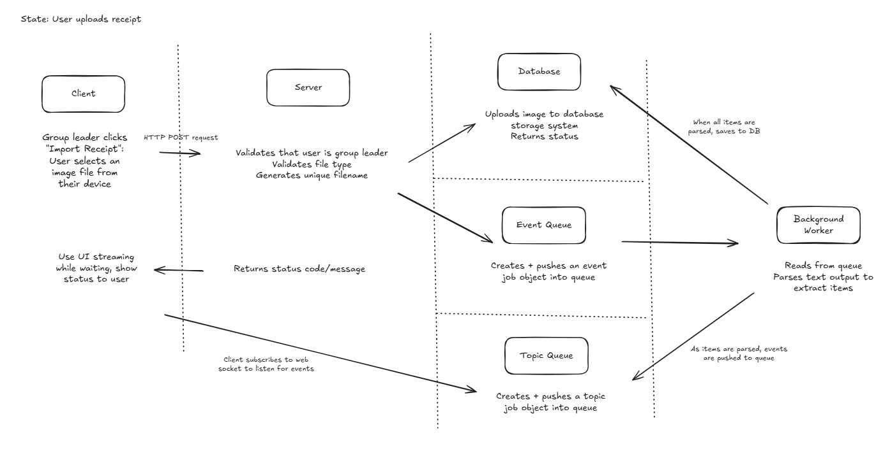
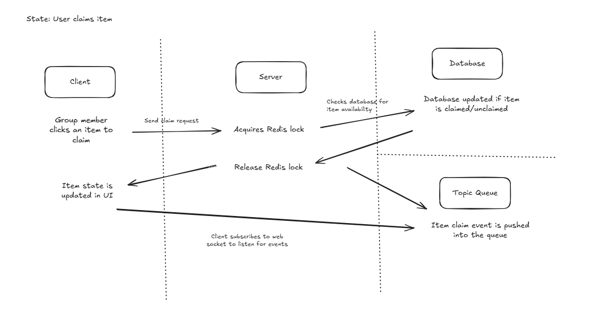
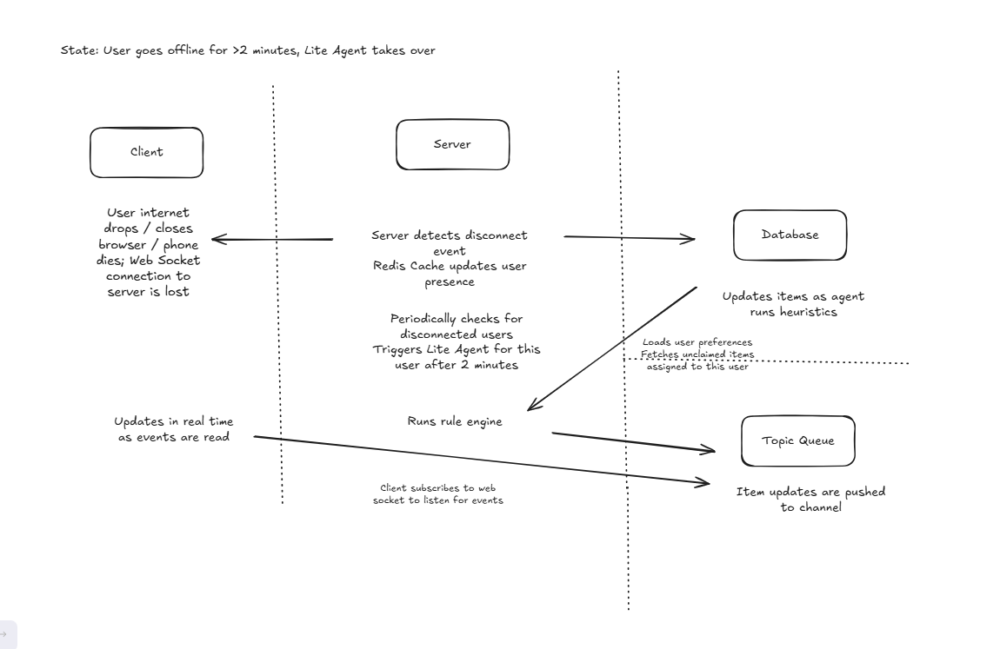
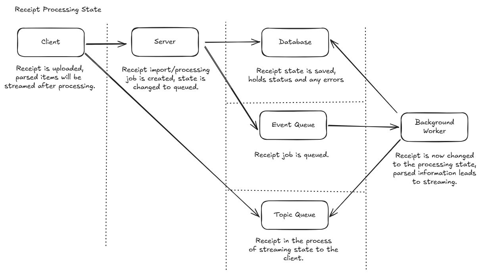
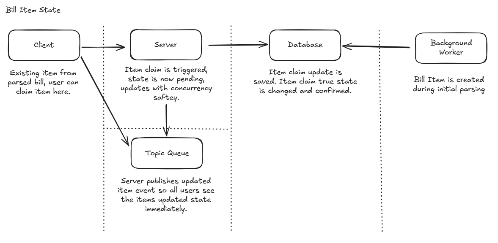
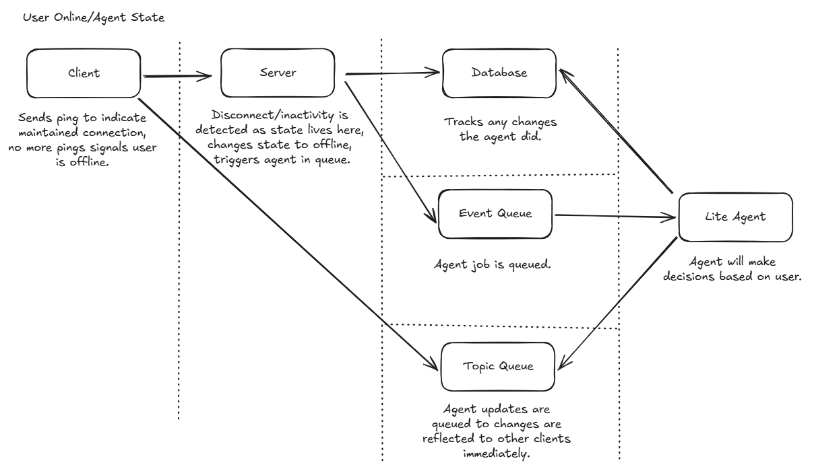

# Bill Split App - Design Document

**Team Members:** Christopher Ridad, Eshan Haq, Adedamola Adejumobi, Joanna Echeverri Porras

---

## 1. Architecture Overview

### Components:
- **Client**: Next.js web application
- **Django Server**: REST API + WebSocket server
- **Background Worker**: Python RQ worker for OCR processing
- **PostgreSQL**: Database (via Supabase)
- **Redis**: Event Queue (job queue) + Topic Queue (pub/sub)
- **Lite Agent**: Auto-approve/reject service

### System Diagram



### Sequence Diagrams







---

## 2. State Model







---

## 3. Data Model (Schema)

```
User {
  id: UUID
  email: String
  name: String
  dietPreferences: JSON
  createdAt: DateTime
}

Group {
  id: UUID
  name: String
  leaderUserId: UUID
  createdAt: DateTime
}

GroupMember {       //enables fast queries + relationship fields reliably
  groupId: UUID
  userId: UUID
  role: String
  joinedAt: DateTime
}

Bill {
  id: UUID
  groupId: UUID
  title: String
  status: String
  subtotal: Float
  tax: Float
  tip: Float
  total: Float
  createdBy: UUID
  createdAt: DateTime
  updatedAt: DateTime
  version: Int
}

Receipt {       // allows bill to have zero or multiple receipt uploads + reliable processing status
  id: UUID
  billId: UUID
  uploadedBy: UUID
  storageUrl: String
  status: String
  error: String | null
  createdAt: DateTime
  updatedAt: DateTime
}

BillItem {
  id: UUID
  billId: UUID
  receiptId: UUID | null
  name: String
  price: Float
  category: String
  status: String
  sortOrder: Int
  splitUsers: UUID[] 
  splitNum: len(splitUsers)
  version: Int
  createdAt: DateTime
  updatedAt: DateTime
}

AgentEvent {        //to keep track of actions taken by agent
  id: UUID
  billId: UUID
  userId: UUID
  eventType: String
  billItemIds: UUID[]
  reason: String
  createdAt: DateTime
}
```

---

## 4. API Design

### Simple actions such as uploading a receipt

#### API Format: GraphQL Mutation

- When someone uploads a receipt, it should be a write operation, and it needs to be non-blocking.
- The uploadReceipt GraphQL mutation takes in the file, pushes an OCR job onto the Redis event queue, and immediately returns a job ID.
- It also updates the bill’s status to PROCESSING and sends back a confirmation right away, without waiting for the OCR to finish.
- This is asynchronous, so the server responds instantly, and the actual OCR processing happens later in a background worker.

### Fetch group, bill, user, and other nested data

#### API Format: GraphQL Query

- We need to fetch the full bill efficiently, so we shouldn’t use a REST API.
- With a GraphQL query, you can grab the whole bill, plus everything nested under it, like items, users, and claims, in a single request.
- The client can ask for only the fields it actually wants, so we’re not stuck with over-fetching or under-fetching.
- With GraphQL, resolvers can fetch related data more intelligently via joins/batching, so we can get everything efficiently from the database.

### Realtime updates

#### API Format: WebSocket

- WebSockets create a bidirectional, persistent connection, so the server can push updates to all connected clients instantly
- If User A claims an item, Users B, C, and D see that change immediately because the server broadcasts it to everyone through the WebSocket.
- While the background worker is processing a receipt, partial OCR results are published to Redis. The server listens for those updates and - streams them to clients via WebSocket, so items show up progressively without a page refresh.
- If the Lite Agent auto-rejects items for someone who’s offline, the rest of the group is notified right away through WebSocket events.
- The server can push events like item_claimed, ocr_progress, agent_action, or user_joined/left without the client having to ask for them.

---

## 5. Failure Scenarios

### Scenarios:
1. Race conditions on an item claim - when two users both try to claim the same item at the same time.
2. User disconnect - user disconnects before actually confirming the items for the bill.
3. Background worker job failure - when a user uploads a receipt, the server must create a job in the Redis Queue, but the background process can crash 

### Implications:
1. Without proper concurrency control, both requests could end up succeeding. This is an issue as it could cause duplicate claims, incorrect totals for the bill, and inconsistent states for users
2. If a user disconnects before confirming their items, then the bill can’t be finalized, which blocks the group from proceeding and also could result in risks of state inconsistency if the user reconnects. 
3. If the background worker crashes or OCR fails, then the receipt could get stuck as “processing” and not be able to change states, resulting in the items for the bill not appearing successfully and breaking the system for the users.

### How the System Should Recover?
1. When the user tries to claim an item, the server implements a Redis distributed lock to make sure that only one update actually succeeds, with the other user receiving the updated state.
2. The server can track the user’s connection using heartbeat/timeout, where if a user is disconnected for a certain period of time (Ex: 2 minutes), they are declared offline, and the lite agent can take over for the user and/or the items they already have. If the user is able to reconnect, then the server continues action with the user as normal.
3. The table that represents a receipt can have a field for “status,” which the background worker updates as the server runs. This way, if any failure occurs, the status can change to reflect that, allowing the user to be notified via the client and letting them know to try uploading it again successfully.

